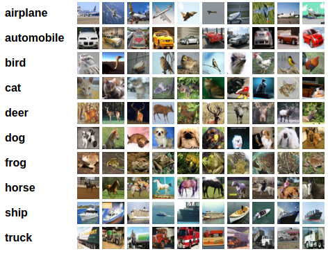
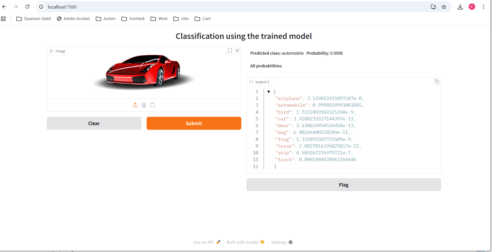

# Image Classification with CNN

**IronHack AI Engineering Bootcamp – January 2026**  
[Project in GitHub](https://github.com/biancaene/ironhack_2026_cnn_group1)

---

## Project Goal

Build a **Convolutional Neural Network (CNN)** model to correctly classify images into predefined categories.

The **CIFAR-10** dataset is used for training and testing the model. It contains images belonging to the following **10 categories**.

*CIFAR-10 extract*

---

## Project Overview

- **CNN model creation**
  - Data preprocessing
  - Iterations on custom models to achieve the best classification accuracy and performance
  - In parallel: transfer learning using the ResNet50 model

- **Evaluation**
  - Human sanity check based on the confusion matrix
  - Performance metrics

- **Model deployment**
  - Gradio demo to use the model with images submitted by the user

- **Reporting**
  - Presentation to exhibit results, methodology, and findings

---

## Project Results

- **Model metrics**

- **Historic overview**

- **Gradio Deployment**



- **Transfer learning**

---

## Project Content

### Description of Content Structure

- **code/**
  - `main`: notebook with the basic CNN used as the starting point for all other models
  - `modelXX`: notebooks containing the rest of the models. An overview of their metrics can be found in the `spreadsheet` folder

- **deployment/**
  - `deployment`: Python code to deploy the model using Gradio
  - `pics`: images used to test the trained models
  - `screenshots`: captures showing predicted categories for the input images

- **spreadsheet/**
  - `G1 – Model Index`: spreadsheet used to store model metrics and track progress

- **trained_models/**
  - Keras files corresponding to all trained models

- **requirements/**
  - The `requirements.txt` file can be used to install the environment needed to run the notebooks  
  - It is recommended to use a **virtual environment**

---

## Environment Setup

```bash
python -m venv .venv
.venv/Scripts/activate
pip install -r requirements.txt
